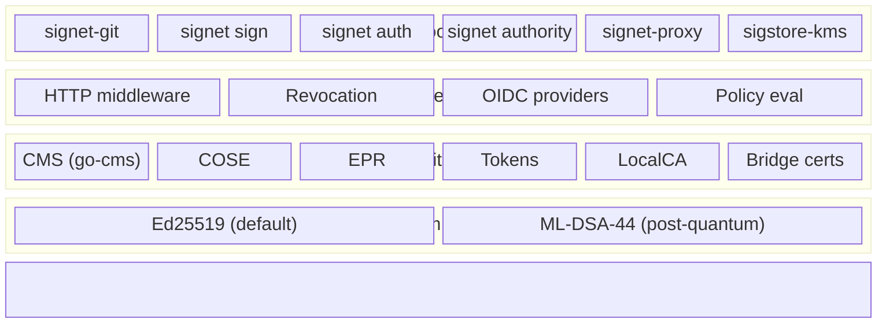
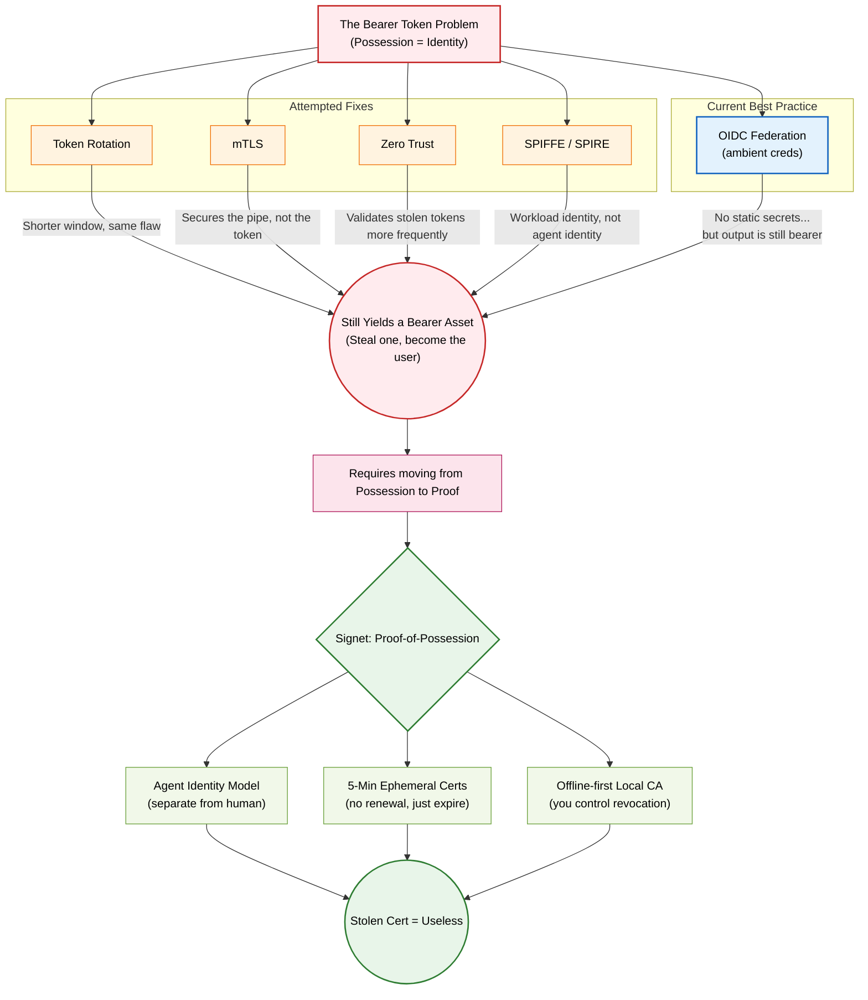

# Signet

Replace bearer tokens with cryptographic proof-of-possession. Signet provides tools for signing commits, files, and HTTP requests using ephemeral certificates with algorithm agility (Ed25519 + ML-DSA-44 post-quantum).

## ⚠️ Status: v0.2.0 Experimental (Alpha)

**Security Note:**
- **Not audited** - use for development only
- Core cryptography is unit-tested (13k+ LOC) and partially fuzzed (3 fuzz functions covering critical parsing paths)
- Native Go implementation via [`go-cms`](https://github.com/agentic-research/go-cms) (no external review, passes OpenSSL interop tests)
- **Platform:** Built for macOS, should work on Linux (minimal testing)
- **Key storage:** Defaults to OS keyring; falls back to plaintext `~/.signet/master.key` when the keyring is unavailable or initialized with `--insecure`
- TouchID integration (macOS) requires CGO; Linux/CI builds are Pure Go (Static)
- See [SECURITY.md](SECURITY.md) for security limitations and best practices

## What Works Today

### 1. Git Commit Signing

Replace GPG with modern Ed25519 signatures:

```bash
# Build and install
make install

# Initialize
signet-git init

# Configure Git
git config --global gpg.format x509
git config --global gpg.x509.program signet-git
git config --global user.signingKey $(signet-git export-key-id)

# Sign commits
git commit -S -m "Signed with Signet"
```

**Features:**
- 5-minute ephemeral certificates from local CA
- OpenSSL-compatible CMS/PKCS#7 signatures
- Sub-millisecond performance (~0.12ms)
- Completely offline

### 2. General File Signing

Sign any file with the same primitives:

```bash
# Initialize with Ed25519 (default, shares keys with git signing)
./signet sign --init

# Or initialize with ML-DSA-44 (post-quantum)
./signet sign --init --algorithm ml-dsa-44

# Sign files
./signet sign document.pdf
# Creates document.pdf.sig

# Verify with OpenSSL (Ed25519 signatures)
openssl cms -verify -binary -in document.pdf.sig -inform PEM
```

### 3. HTTP Authentication Middleware

Two-step verification middleware for Go HTTP servers:

```go
import "github.com/agentic-research/signet/pkg/http/middleware"

auth, err := middleware.SignetMiddleware(
    middleware.WithMasterKey(masterPubKey),
    middleware.WithClockSkew(30*time.Second),
)
if err != nil {
    log.Fatal(err)
}
handler := auth(yourHandler)
```

**Features:**
- Ephemeral proof verification (master→ephemeral→request)
- Replay attack prevention
- Pluggable token/nonce stores (memory, Redis with `redis` build tag)
- Clock skew tolerance
- **Token revocation** via SPIRE-model CA bundle rotation

See [`pkg/http/middleware/README.md`](./pkg/http/middleware/README.md) for details.

### 4. OIDC Identity Bridge

Mint X.509 client certificates from OIDC login (Fulcio-style):

```bash
# Create config file (config.json)
cat > config.json <<EOF
{
  "oidc_provider_url": "https://accounts.google.com",
  "oidc_client_id": "your-client-id",
  "oidc_client_secret": "your-secret",
  "redirect_url": "http://localhost:8080/callback",
  "authority_master_key_path": "/path/to/master.key",
  "listen_addr": ":8080"
}
EOF

# Set session secret (required)
export SIGNET_SESSION_SECRET="$(openssl rand -base64 48)"

# Run authority
./signet authority --config config.json
```

See [`cmd/signet/authority.go`](./cmd/signet/authority.go) for configuration details.

### 5. MCP Client Authentication

One-command onboarding for MCP endpoints with mTLS:

```bash
# Interactive (opens browser for OAuth2 login)
signet auth login

# Headless (for CI/CD agents)
signet auth register --github-token $GITHUB_TOKEN

# Check certificate status
signet auth status
```

**Features:**
- OAuth2 + PKCE browser flow with localhost callback (`signet auth login`)
- GitHub token one-shot registration for headless/CI agents (`signet auth register`)
- ECDSA P-256 keypair generated locally (private key never leaves machine)
- For browser login: refresh token stored for automatic cert renewal
- For register: no refresh token; re-registers when cert is near expiry
- Auto-configures Claude Code (`claude mcp add`)
- Idempotent: re-running reuses an existing valid cert or renews when needed

### 6. GHA OIDC Signing (CI/CD)

Sign artifacts in GitHub Actions using ambient OIDC credentials (no secrets needed):

```bash
# In a GitHub Actions workflow:
signet authority exchange-github-token \
  --authority-url http://localhost:8080 \
  --auto \
  --output /tmp/bridge-cert.pem
```

**Features:**
- Zero secrets stored in repo (uses GHA ambient OIDC identity)
- Bridge certificates with capability X.509 extensions
- Policy-based authorization (repo, workflow, ref filtering)
- Post-merge re-signing workflow (`signet authority setup-resign`)

### Sigstore KMS Plugin

Use Signet keys with the Sigstore ecosystem (cosign, gitsign):

```bash
# Build and install the plugin
go build -o sigstore-kms-signet ./cmd/sigstore-kms-signet
mv sigstore-kms-signet /usr/local/bin/

# Sign artifacts with cosign using your Signet key
cosign sign-blob --key signet://default --tlog-upload=false artifact.bin > artifact.sig
```

See [`docs/sigstore-integration.md`](./docs/sigstore-integration.md) for full setup.

### Reverse Proxy (signet-proxy)

Authenticate multiple clients via Signet proofs, forwarding requests with a shared upstream token:

```bash
go build -o signet-proxy ./cmd/signet-proxy
./signet-proxy --upstream-token $GITHUB_TOKEN --listen :8080
```

See [`cmd/signet-proxy/README.md`](./cmd/signet-proxy/README.md) for details.

### Token Revocation System

SPIRE-model revocation using CA bundle rotation and epoch-based invalidation:

**Features:**
- **Instant revocation** of compromised keys via CA rotation
- **Rollback protection** with monotonic sequence numbers
- **Fail-closed design** - infrastructure failures deny access
- **Grace periods** for smooth key rotation
- **Offline-first** - no CRL/OCSP dependency

**How it works:**
```go
// Configure revocation checker
fetcher := cabundle.NewHTTPSFetcher(bundleServerURL, nil)
storage := cabundle.NewMemoryStorage()
cache := cabundle.NewBundleCache(30 * time.Second)
checker := revocation.NewCABundleChecker(fetcher, storage, cache, bundleSigningPublicKey)

// Add to middleware
auth, err := middleware.SignetMiddleware(
    middleware.WithRevocationChecker(checker),
)
if err != nil {
    log.Fatal(err)
}
handler := auth(yourHandler)
```

Tokens are automatically checked against the CA bundle for:
- Epoch validity (instant revocation of old epochs)
- Key ID matching (CA rotation detection)
- Sequence number monotonicity (rollback attack prevention)

See [`docs/design/006-revocation.md`](./docs/design/006-revocation.md) for architecture details.

## Core Libraries

Signet's primitives are designed to be used independently:

| Package | Purpose | Status |
|---------|---------|--------|
| [`github.com/agentic-research/go-cms`](https://github.com/agentic-research/go-cms) | Ed25519 CMS/PKCS#7 (standalone library) | ⚠️ Unaudited |
| [`pkg/crypto/algorithm`](./pkg/crypto/algorithm) | Algorithm registry (Ed25519, ML-DSA-44) with pluggable ops | Internal† |
| [`pkg/crypto/epr`](./pkg/crypto/epr) | Ephemeral proof generation/verification | Internal† |
| [`pkg/crypto/cose`](./pkg/crypto/cose) | COSE Sign1 for compact wire format | Internal† |
| [`pkg/crypto/keys`](./pkg/crypto/keys) | Algorithm-agile signer with zeroization + pluggable backends (PKCS#11, TouchID) | Internal† |
| [`pkg/attest/x509`](./pkg/attest/x509) | Local CA for short-lived certificates | Internal† |
| [`pkg/signet`](./pkg/signet) | CBOR token structure + SIG1 wire format | Internal† |
| [`pkg/http/middleware`](./pkg/http/middleware) | HTTP authentication middleware (server + client) | Internal† |
| [`pkg/revocation`](./pkg/revocation) | SPIRE-model token revocation system | Internal† |
| [`pkg/lifecycle`](./pkg/lifecycle) | Loan-pattern memory zeroization for sensitive data | Internal† |

† *Internal* = Developed in-house, no independent security audit yet

## Installation

### From Source

```bash
git clone https://github.com/agentic-research/signet.git
cd signet
make build
```

Produces `./signet` and `./signet-git` binaries.

### Requirements

- Go 1.25+
- OpenSSL (for verification)

## Architecture

Signet is a set of cryptographic primitives with tools built on top:



All tools share the same master key, certificate authority, and keystore.

## Development

```bash
# Run tests
make test

# Run integration tests
make integration-test

# Format and lint
make fmt lint
```

## Documentation

- **[Architecture](ARCHITECTURE.md)** - Design decisions and technical rationale
- **[Agent Provenance Standard (APAS)](docs/apas/agent-provenance-standard.md)** - Research and specifications for AI agent identity
- **[Design Docs](docs/design/)** - ADRs and design documents
- **[Contributing](CONTRIBUTING.md)** - How to contribute effectively
- **[Performance](docs/PERFORMANCE.md)** - Benchmarks and analysis
- **[Sigstore Integration](docs/sigstore-integration.md)** - Using Signet keys with cosign/gitsign
- **[CMS Implementation](https://github.com/agentic-research/go-cms/blob/main/docs/IMPLEMENTATION.md)** - Ed25519 CMS/PKCS#7 details (go-cms repo)

## Roadmap

Signet is in **alpha** (v0.2.0).

**Recent (v0.2.0):**
- ✅ GHA OIDC end-to-end signing flow (ambient identity, bridge certs, policy)
- ✅ Cloudflare Access OIDC provider
- ✅ MCP client authentication (`signet auth login/register`)
- ✅ Post-merge re-signing workflow
- ✅ Security audit: 7 findings fixed (JTI race, serial collision, rate limiter hardening)
- ✅ Authority landing page

**Current focus:** MCP auth convergence, Cloudflare deployment.

**Gaps before v1.0:**
- Security audit (required before production use)
- Signature verification CLI (`signet verify`)
- signet-core in Rust/WASM for edge deployment (ADR in progress)

## Contributing

We welcome contributions! See **[CONTRIBUTING.md](CONTRIBUTING.md)** for development setup and guidelines.

**High-impact areas:**
- Core protocol completion (CBOR, COSE, wire format)
- Language SDKs (Python, JavaScript, Rust)
- Security review and testing
- Documentation and examples

**Questions?** Open a [GitHub Discussion](https://github.com/agentic-research/signet/discussions)

## Why Signet?

**Problem:** Bearer tokens (API keys, JWTs, OAuth tokens) are "steal-and-use" credentials. If an attacker gets your token, they are you. Every attempted fix leaves the core vulnerability intact:



**Solution:** Cryptographic proof-of-possession. Every request proves knowledge of a private key without revealing it. Tokens can't be stolen and replayed.

**Unique features:**
- One of the first Go libraries with Ed25519 CMS/PKCS#7 support (via [go-cms](https://github.com/agentic-research/go-cms), not yet security reviewed)
- **Post-quantum ready** via ML-DSA-44 (FIPS 204) using [cloudflare/circl](https://github.com/cloudflare/circl)
- Offline-first design (no network dependencies)
- Ephemeral certificates (5-minute lifetime)
- Sub-millisecond verification
- OpenSSL-compatible output

## License

Apache 2.0 - See [LICENSE](LICENSE)

## Acknowledgments

Inspired by [Sigstore](https://sigstore.dev) for supply chain security. Signet extends the concept to general-purpose authentication with offline-first design.

---

**Questions?** Open an [issue](https://github.com/agentic-research/signet/issues)
**Ready to contribute?** See [CONTRIBUTING.md](CONTRIBUTING.md)
