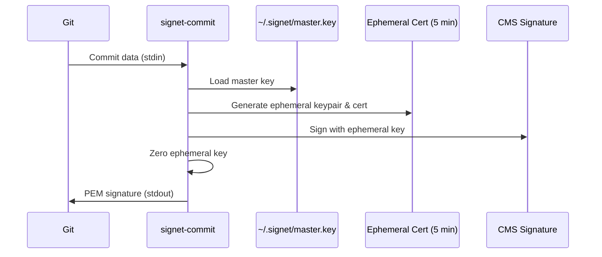

# signet-commit

Git commit signing using ephemeral X.509 certificates.

## Status: 🔨 Alpha (Works!)

This is the most complete part of Signet v0.0.1 - it works today for signing Git commits.

## What It Does



## Files

- `main.go` - CLI entry point, handles Git integration
- `keystore.go` - Master key storage (⚠️ plaintext file!)
- `signer.go` - Orchestrates signing process
- `config.go` - Git configuration helpers

## How to Use

```bash
# Initialize (creates master key)
./signet-commit --init

# Configure Git
git config --global gpg.format x509
git config --global gpg.x509.program $(pwd)/signet-commit
git config --global user.signingKey $(./signet-commit --export-key-id)

# Sign commits
git commit -S -m "Signed with Signet"
```

## Security Notes

⚠️ **Alpha Software:**
- Master key stored in plaintext at `~/.signet/master.key`
- No key encryption or password protection yet
- Use only for experiments, not important repositories

## Technical Details

- Creates self-signed X.509 certificates valid for 5 minutes
- Uses Ed25519 for all cryptographic operations
- Generates CMS/PKCS#7 signatures compatible with Git
- Zeros ephemeral keys after each use