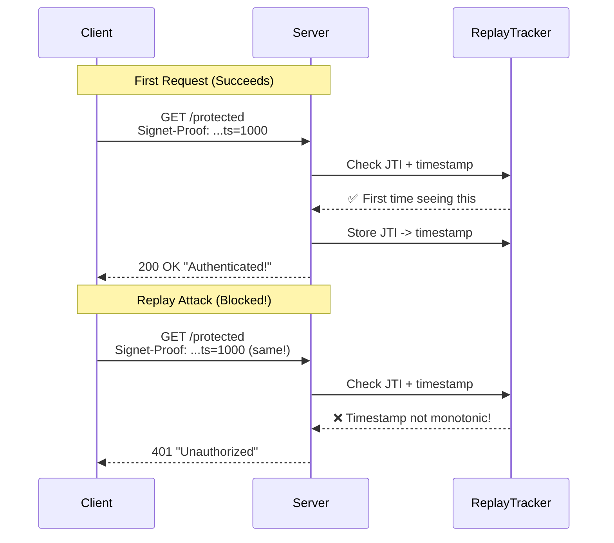

# demo/http-auth

HTTP authentication demo showing replay protection.

## Status: 🔬 Demo (It Works!)

This demo proves that bearer tokens can be replaced with cryptographic proofs that prevent replay attacks.

## What It Demonstrates



## Files

- `main.go` - HTTP server with replay protection
- `client/main.go` - Test client demonstrating attacks
- `run_demo.sh` - Automated demo script

## How to Run

```bash
# Build and run
cd demo/http-auth
go build -o server main.go && ./server &
go build -o client/main client/main.go && ./client/main

# Output shows:
# ✅ Normal requests succeed (increasing timestamps)
# ❌ Replayed requests BLOCKED: "timestamp not monotonic"
# ✅ Different JTIs are independent
```

## Security Features Demonstrated

1. **Monotonic Timestamps**: Each JTI must use strictly increasing timestamps
2. **Clock Skew Window**: ±30 seconds tolerance
3. **Replay Prevention**: Same request can't be used twice
4. **JTI Independence**: Different JTIs track separately

## Implementation Details

```go
// The key enforcement
if exists && !timestamp.After(lastSeen) {
    return fmt.Errorf("replay detected: timestamp not strictly monotonic")
}

// Clock skew protection
if timestamp.Before(now.Add(-30*time.Second)) ||
   timestamp.After(now.Add(30*time.Second)) {
    return fmt.Errorf("timestamp outside acceptable window")
}
```

## Security Notes

⚠️ **Demo Code Only:**
- Signature verification simplified (just checks length)
- In-memory replay tracking (resets on restart)
- No request canonicalization yet
- For demonstration purposes only

## What This Proves

**Bearer tokens CAN be replaced!** This demo shows:
- Cryptographic proofs prevent token theft
- Replay attacks are blocked
- No database or network calls needed
- Sub-millisecond verification time
