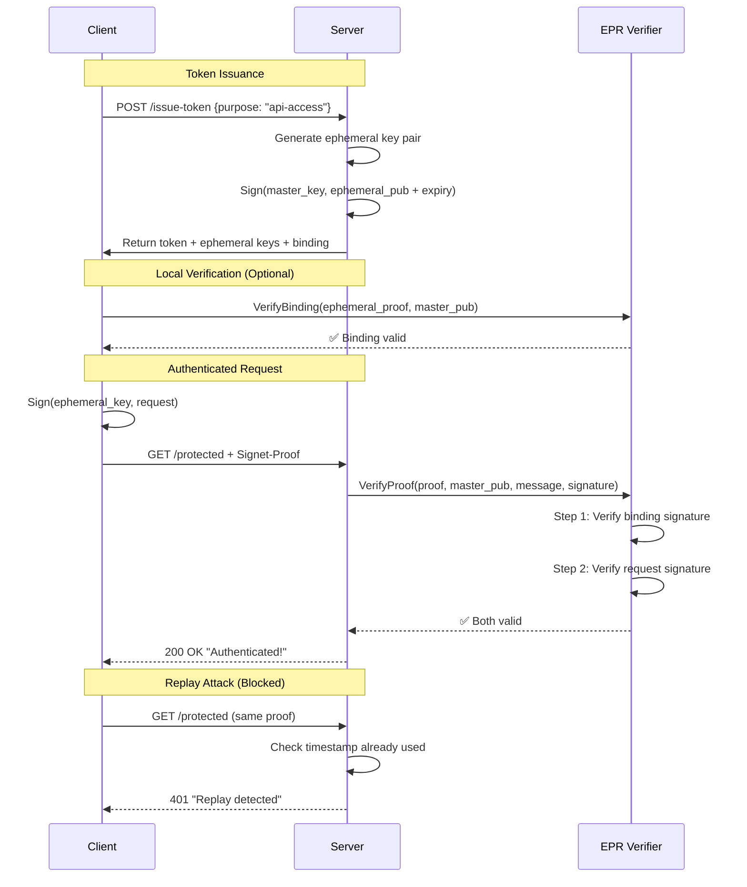

# Signet HTTP Authentication Demo

This demo demonstrates the **correct implementation** of Signet's two-step cryptographic verification protocol for HTTP authentication. Unlike simpler approaches that only verify signatures, this implementation maintains the full security properties of the Signet protocol.

## Protocol Overview

The Signet protocol provides ephemeral proof-of-possession through a two-step verification chain:

```
Master Key → [signs] → Ephemeral Key Binding → [signs] → Request
```

This ensures:
1. **Proof of Master Key Possession**: The server proves it owns the master key
2. **Ephemeral Key Authorization**: Each ephemeral key is explicitly authorized by the master
3. **Purpose Binding**: Ephemeral keys are bound to specific purposes
4. **Time Limitation**: All keys have explicit expiry times
5. **Replay Protection**: Each request has unique timestamps preventing replay

## Architecture

### Server (`server/main.go`)

The server implements:
- **Token Issuance**: Generates CBOR tokens with ephemeral key bindings
- **Two-Step Verification**: Uses `epr.Verifier` to verify both binding and request signatures
- **Token Registry**: Stores issued tokens with their cryptographic context
- **Replay Protection**: Tracks used timestamps per token

### Client (`client/main.go`)

The client demonstrates:
- **Token Request**: Obtains tokens with ephemeral key bindings
- **Proof Generation**: Signs requests with ephemeral private keys
- **Local Verification**: Can verify binding signatures client-side
- **Multiple Scenarios**: Shows normal flow, replay prevention, and token independence

### Production Middleware Demo (`server-with-middleware/main.go`)

**Recommended for production use.** Demonstrates the `pkg/http/middleware` package:
- Production-ready verification pipeline
- Pluggable token/nonce stores (memory, Redis)
- Configurable clock skew tolerance
- JSON error responses
- Custom logging integration
- Path-based authentication bypass

Runs on port **:8081** (different from simple demo).

### Original Demo (`main.go`)

The original simplified demo shows basic replay protection without full cryptographic verification. Kept for reference to show the evolution from simple to complete implementation.

## Running the Demo

### Production Middleware Demo (Best for integration examples)

1. Start the middleware server:
```bash
go run demo/http-auth/server-with-middleware/main.go
```

2. Test with curl:
```bash
# Get a token
TOKEN_RESPONSE=$(curl -s -X POST http://localhost:8081/issue-token \
  -H "Content-Type: application/json" \
  -d '{"purpose": "api-access"}')

echo $TOKEN_RESPONSE | jq .

# To make authenticated requests, you need to:
# 1. Sign the request with the ephemeral_private key
# 2. Send Signet-Proof header with token + signature
# (See client implementation for signing logic)
```

3. Test authentication (requires client support for signing):
```bash
# Health check (no auth required)
curl http://localhost:8081/health

# Protected endpoint (requires Signet-Proof header)
curl http://localhost:8081/protected \
  -H "Signet-Proof: token=<token>, signature=<sig>, timestamp=<ts>, nonce=<nonce>"
```

### Full Two-Step Verification (Educational)

1. Start the server:
```bash
go run demo/http-auth/server/main.go
```

2. In another terminal, run the client:
```bash
go run demo/http-auth/client/main.go
```

### Simple Demo (Original)

```bash
# Terminal 1
go run demo/http-auth/main.go

# Terminal 2
go run demo/http-auth/client/main.go
```

## What the Demo Shows



## Key Implementation Details

### Token Structure (CBOR with integer keys)
```go
type Token struct {
    IssuerID       string // 1: Issuer identifier
    ConfirmationID []byte // 2: Master key hash
    ExpiresAt      int64  // 3: Unix timestamp
    Nonce          []byte // 4: 16 bytes
    EphemeralKeyID []byte // 5: Ephemeral key hash
    NotBefore      int64  // 6: Unix timestamp
}
```

### Two-Step Verification
```go
// Full verification in one call
err := verifier.VerifyProof(
    ctx,
    ephemeralProof,     // Contains ephemeral key + binding signature
    masterPublicKey,    // Server's master key
    token.ExpiresAt,    // Expiry time
    purpose,            // "api-access", "service-b", etc.
    canonicalRequest,   // Method|Path|Timestamp|Nonce
    requestSignature,   // Client's signature
)
```

## Security Properties

### ✅ What This Implementation Provides
- **Cryptographic chain of trust** - Two-step verification proves authorization
- **Purpose-bound ephemeral keys** - Keys limited to specific uses
- **Time-bound tokens** - Automatic expiry after 5 minutes
- **Replay attack prevention** - Per-token timestamp tracking
- **Domain separation** - Prevents cross-protocol attacks
- **Offline verification** - No network calls needed

### ❌ Common Implementation Mistakes to Avoid
- **Storing naked ephemeral keys** - Breaks the chain of trust
- **Skipping binding verification** - No proof of master key authorization
- **Manual key registration** - Bypasses the protocol entirely
- **Single-step verification** - Loses security properties
- **Missing canonicalization** - Signature verification failures
- **No purpose binding** - Ephemeral keys usable for anything

## Mathematical Foundation

The protocol implements a cryptographic proof system:

```
Let M = master key pair (M_pub, M_priv)
Let E = ephemeral key pair (E_pub, E_priv)
Let T = timestamp, P = purpose, N = nonce

Binding: σ_b = Sign(M_priv, DomainSeparator || E_pub || T || P)
Request: σ_r = Sign(E_priv, Method || Path || T || N)

Verification requires:
1. Verify(M_pub, DomainSeparator || E_pub || T || P, σ_b) = true
2. Verify(E_pub, Method || Path || T || N, σ_r) = true
```

This creates a non-repudiable chain proving the master key authorized the specific ephemeral key for the specific purpose and time window.

## Demo Comparison

| Feature | `server/` (Educational) | `server-with-middleware/` (Production) |
|---------|------------------------|----------------------------------------|
| **Port** | :8080 | :8081 |
| **Token Storage** | Custom `sync.Map` | `middleware.MemoryTokenStore` |
| **Verification** | Manual `epr.Verifier` calls | `middleware.SignetHandler` |
| **Error Handling** | Basic HTTP errors | JSON error responses |
| **Clock Skew** | None | Configurable (30s default) |
| **Path Bypass** | None | Skip auth on `/health`, `/issue-token` |
| **Logging** | Custom | Pluggable interface |
| **Production Ready** | ❌ Demo only | ✅ Yes |
| **Use Case** | Learning protocol internals | Integration examples |

**When to use which:**
- **`server/`**: Understanding how two-step verification works internally
- **`server-with-middleware/`**: Integrating Signet into your service
- **`main.go`**: Quick replay protection demo (legacy)

## Production Considerations

This demo simplifies certain aspects for clarity:

1. **Token Distribution**: In production, tokens would be distributed through a separate secure channel
2. **Key Storage**: Master keys should be in HSM or secure key management systems
3. **Token Storage**: Use distributed cache (Redis) or database instead of in-memory map
4. **Canonicalization**: Implement full HTTP request canonicalization including headers and body
5. **Ephemeral Private Keys**: Should be securely destroyed after use
6. **Audit Logging**: Log all verification attempts and failures

## Demo Output Example

```
🔐 Signet HTTP Auth Demo Client
================================

✅ Server is healthy

Demo 1: Two-Step Cryptographic Verification
--------------------------------------------
Step 1: Requesting token with ephemeral key binding...
✅ Received token: a1b2c3d4
   - Purpose: api-access
   - Expires: 2024-01-15T10:35:00Z
   - Master key hash: 1234abcd
   - Ephemeral key hash: 5678efgh

Step 2: Verifying binding signature locally...
✅ Binding signature verified (master→ephemeral)

Step 3: Making authenticated requests...
  ✅ Attempt 1: Authenticated! Token: a1b2c3d4, Purpose: api-access
  ✅ Attempt 2: Authenticated! Token: a1b2c3d4, Purpose: api-access
  ✅ Attempt 3: Authenticated! Token: a1b2c3d4, Purpose: api-access

Demo 2: Replay Attack Prevention
---------------------------------
✅ Got new token: e5f6g7h8

First request with timestamp: 1705318500
  ✅ Attempt 1: Authenticated! Token: e5f6g7h8, Purpose: replay-test

Replaying same request 1 second later...
  ❌ Attempt 2: Failed with status 401: {"error": "Replay detected"}

✨ Demo complete! This demonstrates:
  1. ✅ Full two-step cryptographic verification (master→ephemeral→request)
  2. ✅ Token-based ephemeral key binding with proper CBOR encoding
  3. ✅ Client-side binding verification capability
  4. ❌ Replay attacks are blocked (same token + timestamp)
  5. ✅ Different tokens are independent (different purposes)
  6. ✅ Purpose-specific ephemeral keys enforcement

🔗 Cryptographic Chain of Trust:
  Master Key → [signs] → Ephemeral Key Binding
  Ephemeral Key → [signs] → Request
  Server verifies BOTH signatures in sequence
```
