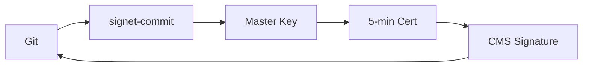
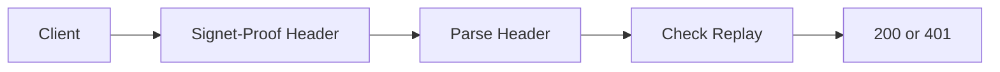

# Signet v0.0.1 Implementation Status

Clear documentation of what's actually built vs planned.

## Component Status Overview

| Component | Status | Usable? | Location |
|-----------|--------|---------|----------|
| **Git Commit Signing** | 🔨 Alpha | ✅ Yes | `cmd/signet-commit/` |
| **CMS/PKCS#7 with Ed25519** | 🧪 Experimental | ✅ Yes | `pkg/cms/` |
| **Ephemeral Proofs** | 🧪 Experimental | ✅ Yes | `pkg/crypto/epr/` |
| **Local CA** | 🧪 Experimental | ✅ Yes | `pkg/attest/x509/` |
| **Token Structure** | 🧪 Experimental | ✅ Yes | `pkg/signet/` |
| **HTTP Header Parser** | 🚧 Development | ⚠️ Partial | `pkg/http/header/` |
| **HTTP Demo** | 🔬 Demo | ✅ Yes | `demo/http-auth/` |

## Architecture Diagrams

### 1. Git Commit Signing (WORKING)



**Status:** ✅ Fully functional for Git signing

### 2. HTTP Authentication (DEMO ONLY)



**Status:** ⚠️ Demo works, production integration pending

## What Actually Works in v0.0.1

### ✅ Complete and Working

1. **Git Commit Signing**
   - Generate master keys
   - Create ephemeral certificates
   - Sign commits with CMS/PKCS#7
   - OpenSSL-compatible output

2. **Cryptographic Primitives**
   - Ed25519 throughout
   - Two-step verification (EPR)
   - Domain separation
   - Key zeroization

3. **HTTP Demo**
   - Replay protection demonstration
   - Monotonic timestamp enforcement
   - Clock skew validation

### ⚠️ Partially Implemented

1. **HTTP Middleware**
   - ✅ Header parser works
   - ❌ Request canonicalization missing
   - ❌ Signature verification not wired up
   - ❌ Framework adapters not built

2. **Token Wire Format**
   - ✅ CBOR encoding works
   - ❌ `SIG1.<token>.<sig>` format not complete

### ❌ Not Implemented Yet

1. **Key Management**
   - Encrypted key storage
   - Password protection
   - Key rotation automation

2. **Production HTTP**
   - Full request signing
   - Middleware adapters
   - Client libraries

3. **Advanced Features**
   - COSE support
   - JWK integration
   - Cloud KMS support

## Security Considerations for v0.0.1

⚠️ **EXPERIMENTAL SOFTWARE**

**Known Limitations:**
- Master keys stored in plaintext (`~/.signet/master.key`)
- No key encryption or password protection
- No security audit performed
- APIs will change before v1.0

**What IS Secure:**
- Cryptographic operations (Ed25519)
- Ephemeral key generation
- Domain separation implementation
- Memory zeroization

## File Structure Guide

```
signet/
├── cmd/
│   └── signet-commit/    # Git signing CLI (Alpha - Works!)
├── pkg/
│   ├── cms/              # CMS/PKCS#7 implementation (Working!)
│   ├── crypto/epr/       # Ephemeral proofs (Working!)
│   ├── attest/x509/      # Certificate generation (Working!)
│   ├── signet/           # Token structures (Working!)
│   └── http/
│       ├── header/       # Header parser (Working!)
│       └── (rest)        # Not implemented yet
├── demo/
│   └── http-auth/        # Replay protection demo (Working!)
└── docs/
    └── (various)         # Mix of implemented and aspirational
```

## Quick Start Examples

### Git Signing (Works Today!)

```bash
# Build and init
make build
./signet-commit --init

# Configure Git
git config --global gpg.format x509
git config --global gpg.x509.program $(pwd)/signet-commit

# Sign commits
git commit -S -m "Signed with Signet"
```

### HTTP Demo (Shows the Concept!)

```bash
cd demo/http-auth
go run main.go &           # Start server
go run client/main.go      # Run demo client

# See replay protection in action!
```

## For Contributors

**What needs work for v1.0:**
1. Encrypted key storage
2. Complete HTTP middleware
3. Client SDKs (Python, JS)
4. Production hardening
5. Security audit

**What's solid and can be built upon:**
1. CMS/PKCS#7 implementation
2. Ephemeral proof architecture
3. Token structure (CBOR)
4. Replay protection design

---

**Status:** v0.0.1 - Experimental software for evaluation and development only.
**Production use:** Not recommended until v1.0 with security audit.
