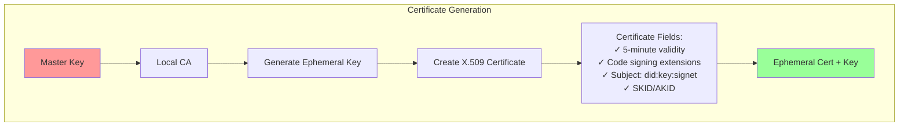

# pkg/attest/x509

Local Certificate Authority for ephemeral X.509 certificates.

## Status: 🧪 Experimental

Generates short-lived certificates for Git signing and authentication.

## What It Does

Creates self-signed X.509 certificates with 5-minute lifetimes:



## Files

- `localca.go` - Certificate generation logic

## Certificate Structure

```go
// What gets created:
Certificate {
    Version:      3 (X.509 v3)
    SerialNumber: Random 128-bit
    Subject:      CN=did:key:signet, O=Signet
    Issuer:       CN=did:key:signet, O=Signet  // Self-signed
    NotBefore:    Now
    NotAfter:     Now + 5 minutes
    KeyUsage:     DigitalSignature
    ExtKeyUsage:  CodeSigning

    // Key identifiers for chain validation
    SubjectKeyId:   SHA-1(ephemeralPublicKey)
    AuthorityKeyId: SHA-1(masterPublicKey)
}
```

## Usage Example

```go
ca := NewLocalCA(masterPrivateKey)
cert, ephemeralKey, err := ca.CreateEphemeralCertificate(purpose)

// Use the cert for signing
signature := sign(ephemeralKey, data)

// Zero the ephemeral key after use
zeroKey(ephemeralKey)
```

## Security Notes

⚠️ **Not for Production PKI:**
- Self-signed certificates only
- No certificate revocation support
- No OCSP or CRL
- Suitable for development and Git signing

## Why 5 Minutes?

- Long enough for a Git commit operation
- Short enough to limit exposure if compromised
- No need for revocation infrastructure
- Forces regular key rotation