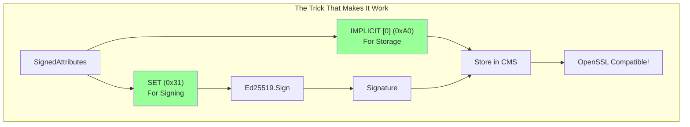

# pkg/cms

CMS/PKCS#7 signature implementation with Ed25519 support.

## Status: 🧪 Experimental (Working!)

**First Go library to support Ed25519 in CMS/PKCS#7 format!**

## What It Does

Creates OpenSSL-compatible CMS signatures using Ed25519 keys. The key innovation is dual encoding of SignedAttributes:



## Files

- `signer.go` - Core CMS implementation
- `signer_test.go` - Tests with RFC 8032 test vectors

## How It Works

```go
// The magic happens here:
signedAttrs := createSignedAttributes(digest, signingTime)

// For signing: Encode as SET (what OpenSSL expects)
toSign := encodeAttributesAsSet(signedAttrs)  // Tag: 0x31
signature := ed25519.Sign(privateKey, toSign)

// For storage: Encode as IMPLICIT [0]
toStore := encodeAttributesAsImplicit(signedAttrs)  // Tag: 0xA0

// Both go into the final CMS structure
```

## OpenSSL Verification

```bash
# Our signatures verify with OpenSSL!
openssl cms -verify -in signature.pem -inform PEM \
  -noverify -content message.txt -binary
```

**Note:** The `-binary` flag is required for detached signatures.

## Technical Details

- Implements RFC 5652 (CMS) with RFC 8419 (Ed25519 in CMS)
- Uses deterministic ASN.1 DER encoding
- Includes signing time and message digest attributes
- Self-signed certificates with 5-minute validity
- Certificates are emitted using `[0]` IMPLICIT tagging with the raw DER
  certificate bytes (no nested SET), matching OpenSSL's
  `CMS_CertificateChoices` expectations

## Test Vectors

Uses RFC 8032 Section 7.1 test vectors (allowlisted in `.gitleaks.toml`):
- Secret key: `9d61b19deffd5a60ba844af492ec2cc44449c5697b326919703bac031cae7f60`
- Public key: `d75a980182b10ab7d54bfed3c964073a0ee172f3daa62325af021a68f707511a`

These are public test vectors, not secrets!
