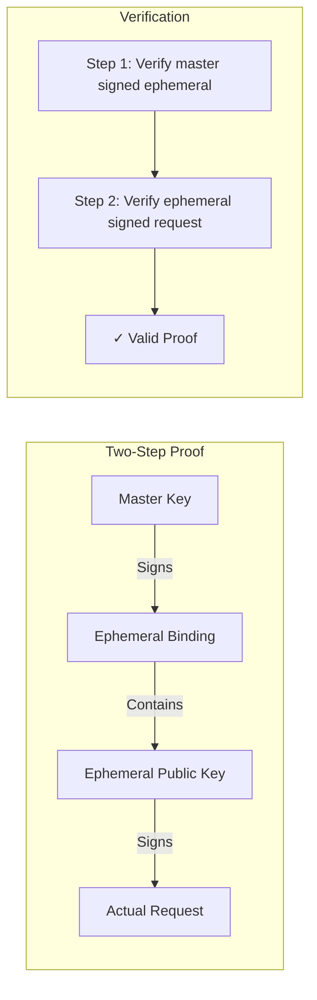

# pkg/crypto/epr

Ephemeral Proof Routines - Two-step cryptographic verification.

## Status: 🧪 Experimental

Core cryptographic primitive for proof-of-possession.

## What It Does

Implements two-step verification where a master key authorizes ephemeral keys:



## Files

- `proof.go` - Proof generation and binding
- `proof_test.go` - Test coverage
- `verifier.go` - Two-step verification logic

## How It Works

```go
// Step 1: Master authorizes ephemeral
binding := createBinding(ephemeralPubKey, expiry, purpose)
masterSig := ed25519.Sign(masterPriv, binding)

// Step 2: Ephemeral signs request
requestSig := ed25519.Sign(ephemeralPriv, requestData)

// Verification checks both steps
valid := verifyMasterBinding(masterPub, binding, masterSig) &&
         verifyRequest(ephemeralPub, requestData, requestSig)
```

## Key Features

- **Domain Separation**: Uses `"signet-ephemeral-binding-v1:"` prefix
- **Forward Secrecy**: Ephemeral keys destroyed after use
- **Time-Bound**: Each ephemeral has expiry time
- **Purpose-Bound**: Ephemeral keys tagged with purpose

## Security Properties

- Ephemeral keys cannot be used without master authorization
- Master key never signs actual requests (only bindings)
- Each ephemeral key used once then destroyed
- Prevents key substitution attacks via domain separation