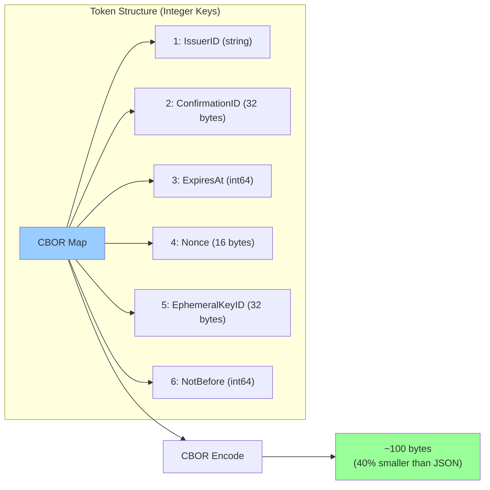

# pkg/signet

Core Signet token structures and encoding.

## Status: 🧪 Experimental

Token format and CBOR encoding implementation.

## What It Does

Defines the Signet token structure using CBOR with integer keys:



## Files

- `token.go` - Token structure and encoding

## Token Fields

| Key | Field | Type | Purpose |
|-----|-------|------|---------|
| 1 | IssuerID | string | Identity of token issuer |
| 2 | ConfirmationID | []byte | SHA-256 of master public key |
| 3 | ExpiresAt | int64 | Unix timestamp expiry |
| 4 | Nonce | []byte | 16-byte random for replay protection |
| 5 | EphemeralKeyID | []byte | SHA-256 of ephemeral public key |
| 6 | NotBefore | int64 | Unix timestamp for activation |

## Why Integer Keys?

- **Smaller tokens**: ~40% size reduction vs string keys
- **Deterministic encoding**: Same token always produces same bytes
- **Efficient parsing**: Faster to decode integers than strings
- **Version-friendly**: New keys can be added without breaking parsers

## CBOR Benefits

- Binary format (smaller than JSON)
- Self-describing (includes type information)
- RFC 8949 standard
- Deterministic encoding mode available
- Widely supported across languages

## Wire Format (Planned)

```
SIG1.<base64url(cbor_token)>.<base64url(signature)>
```

**Note:** Full wire format not yet implemented in v0.0.1

## Usage Example

```go
token := &Token{
    IssuerID:        "did:key:signet",
    ConfirmationID:  sha256(masterPubKey),
    ExpiresAt:       time.Now().Add(5*time.Minute).Unix(),
    Nonce:           generateNonce(),
    EphemeralKeyID:  sha256(ephemeralPubKey),
    NotBefore:       time.Now().Unix(),
}

encoded, err := cbor.Marshal(token)  // ~100 bytes
```
