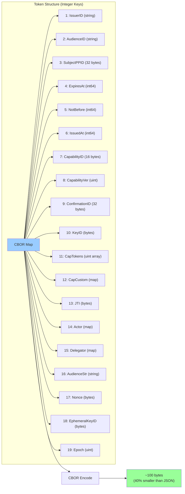

# pkg/signet

Core Signet token structures and encoding.

## Status: 🧪 Experimental

Token format and CBOR encoding implementation.

## What It Does

Defines the Signet token structure using CBOR with integer keys:


```mermaid
graph LR
    subgraph "Token Structure (Integer Keys)"
        Token[CBOR Map]
        Token --> K1["1: IssuerID (string)"]
        Token --> K2["2: AudienceID (string)"]
        Token --> K3["3: SubjectPPID (32 bytes)"]
        Token --> K4["4: ExpiresAt (int64)"]
        Token --> K5["5: NotBefore (int64)"]
        Token --> K6["6: IssuedAt (int64)"]
        Token --> K7["7: CapabilityID (16 bytes)"]
        Token --> K8["8: CapabilityVer (uint)"]
        Token --> K9["9: ConfirmationID (32 bytes)"]
        Token --> K10["10: KeyID (bytes)"]
        Token --> K11["11: CapTokens (uint array)"]
        Token --> K12["12: CapCustom (map)"]
        Token --> K13["13: JTI (bytes)"]
        Token --> K14["14: Actor (map)"]
        Token --> K15["15: Delegator (map)"]
        Token --> K16["16: AudienceStr (string)"]
        Token --> K17["17: Nonce (bytes)"]
        Token --> K18["18: EphemeralKeyID (bytes)"]
        Token --> K19["19: Epoch (uint)"]
    end

    Token --> Encode[CBOR Encode]
    Encode --> Compact["~100 bytes<br/>(40% smaller than JSON)"]

    style Token fill:#99ccff
    style Compact fill:#99ff99
```

## Files

- `token.go` - Token structure and canonical CBOR encoding
- `sig1.go` - SIG1 wire-format encoding, decoding, and verification

## Token Fields

| Key | Field | Type | Purpose |
|-----|-------|------|---------|
| 1 | IssuerID | string | Identity of token issuer |
| 2 | AudienceID | string | Optional audience identifier |
| 3 | SubjectPPID | []byte | Pairwise subject identifier |
| 4 | ExpiresAt | int64 | Unix timestamp expiry |
| 5 | NotBefore | int64 | Unix timestamp for activation |
| 6 | IssuedAt | int64 | Unix timestamp of issuance |
| 7 | CapabilityID | []byte | 128-bit capability identifier |
| 8 | CapabilityVer | uint32 | Optional capability version |
| 9 | ConfirmationID | []byte | SHA-256 of master public key |
| 10 | KeyID | []byte | Optional signing key identifier |
| 11 | CapTokens | []uint64 | Optional capability token IDs |
| 12 | CapCustom | map | Optional custom capability claims |
| 13 | JTI | []byte | Token identifier |
| 14 | Actor | map | Optional actor claims |
| 15 | Delegator | map | Optional delegator claims |
| 16 | AudienceStr | string | Optional human-readable audience |
| 17 | Nonce | []byte | Optional replay-prevention nonce |
| 18 | EphemeralKeyID | []byte | Optional ephemeral key identifier |
| 19 | Epoch | uint64 | Optional revocation epoch |

## Why Integer Keys?

- **Smaller tokens**: ~40% size reduction vs string keys
- **Deterministic encoding**: Same token always produces same bytes
- **Efficient parsing**: Faster to decode integers than strings
- **Version-friendly**: New keys can be added without breaking parsers

## CBOR Benefits

- Binary format (smaller than JSON)
- Self-describing (includes type information)
- RFC 8949 standard
- Deterministic encoding mode available
- Widely supported across languages

## Wire Format

```
SIG1.<base64url(cbor_token)>.<base64url(signature)>
```

`EncodeSIG1` creates this format with a COSE_Sign1 Ed25519 signature;
`DecodeSIG1` parses it and `VerifySIG1` verifies the signature.

## Usage Example

```go
// Construct a validated Token, then encode it with a COSE signer.
wire, err := EncodeSIG1(token, signer)
```
